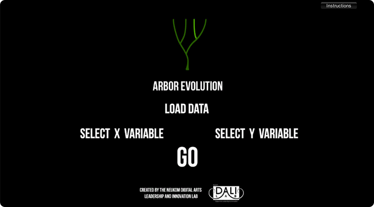
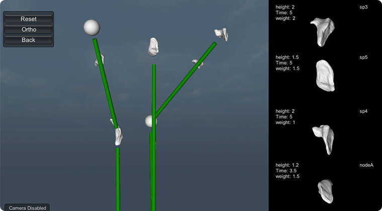
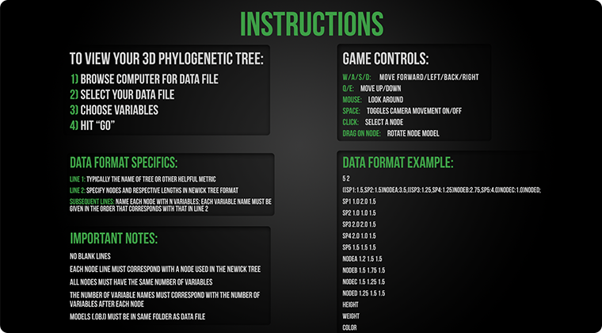

I was a designer and C# developer on this project at the [DALI Lab](http://dali.dartmouth.edu).

Arbor is a Unity game that renders creature models and phylogeny trees for feature comparison and analysis. Researchers are able to view 3d models of organism features online in the context of species' evolutionary position or other metrics.  

Full source available on [github](https://github.com/dali-lab/arbor/).

Users pass in a file describing the phylogeny tree and .obj files of the models. Arbor then parses the tree data and renders the models within a three dimensional tree structure, with the x y and z axes being different relational metrics.

