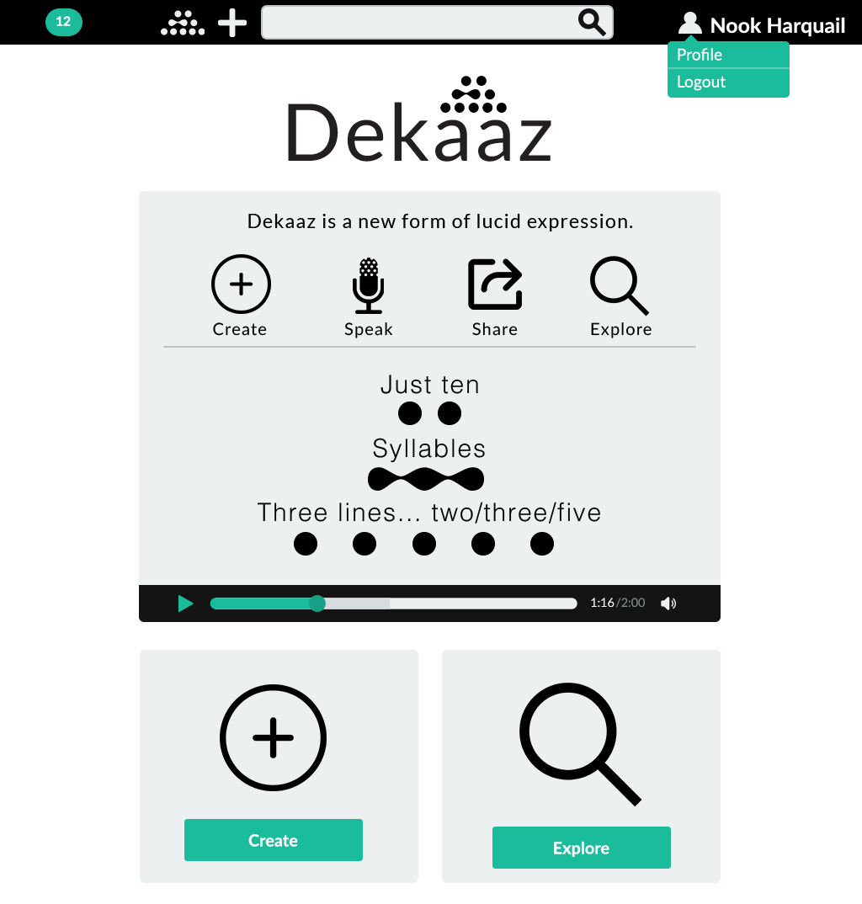
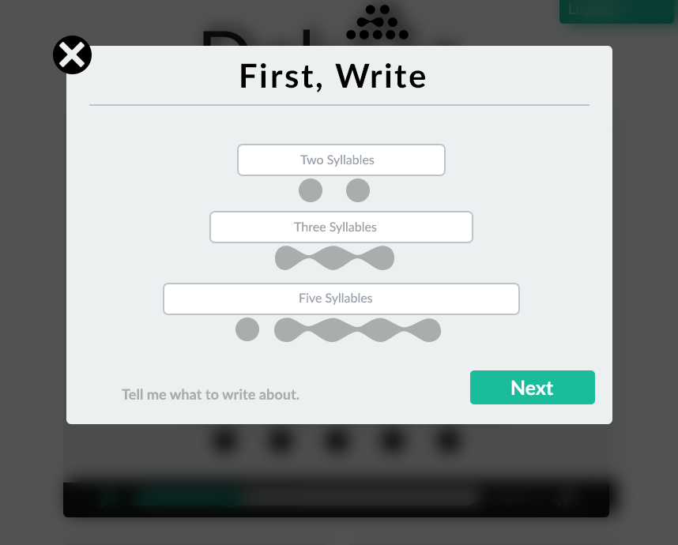
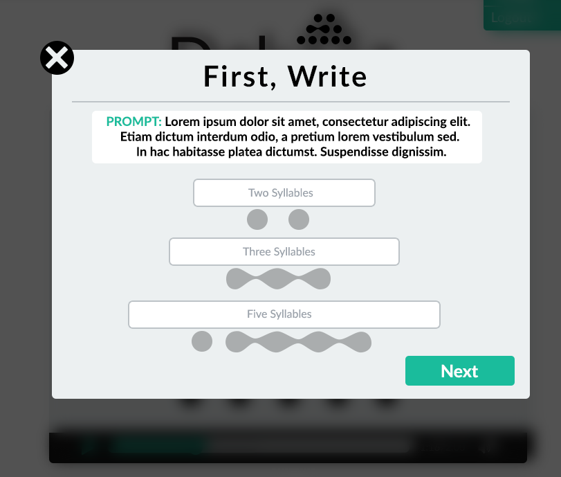
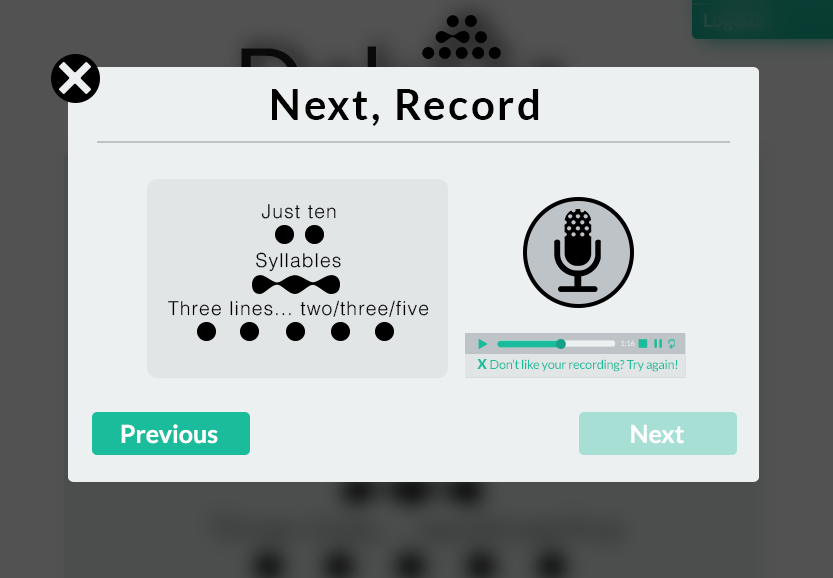
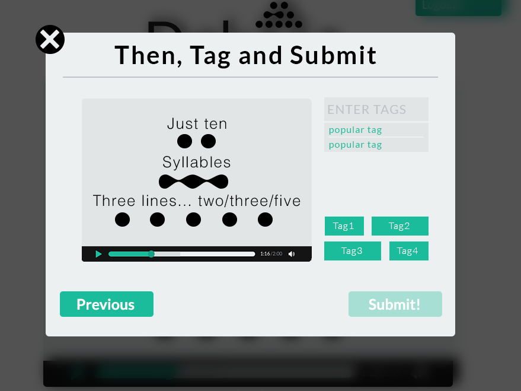
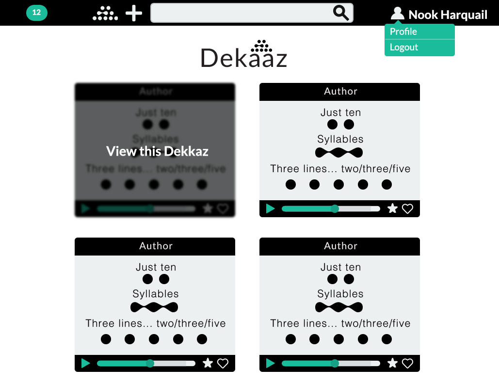
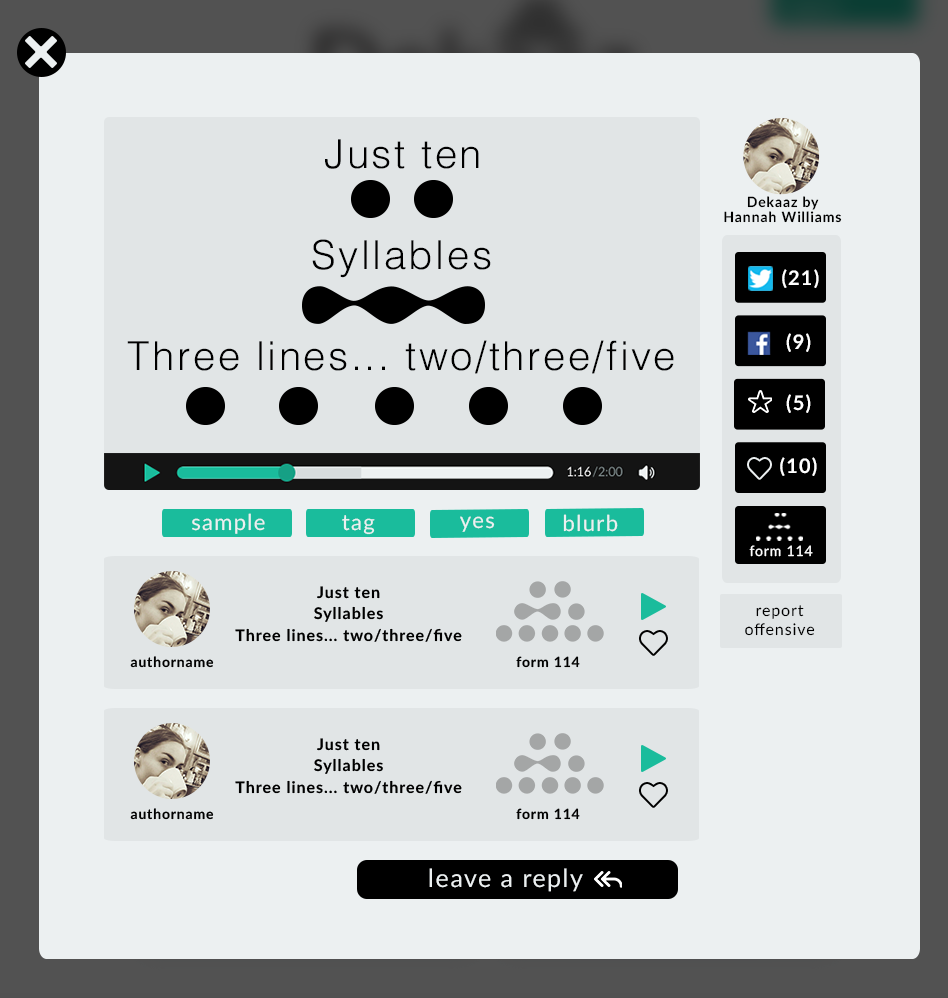
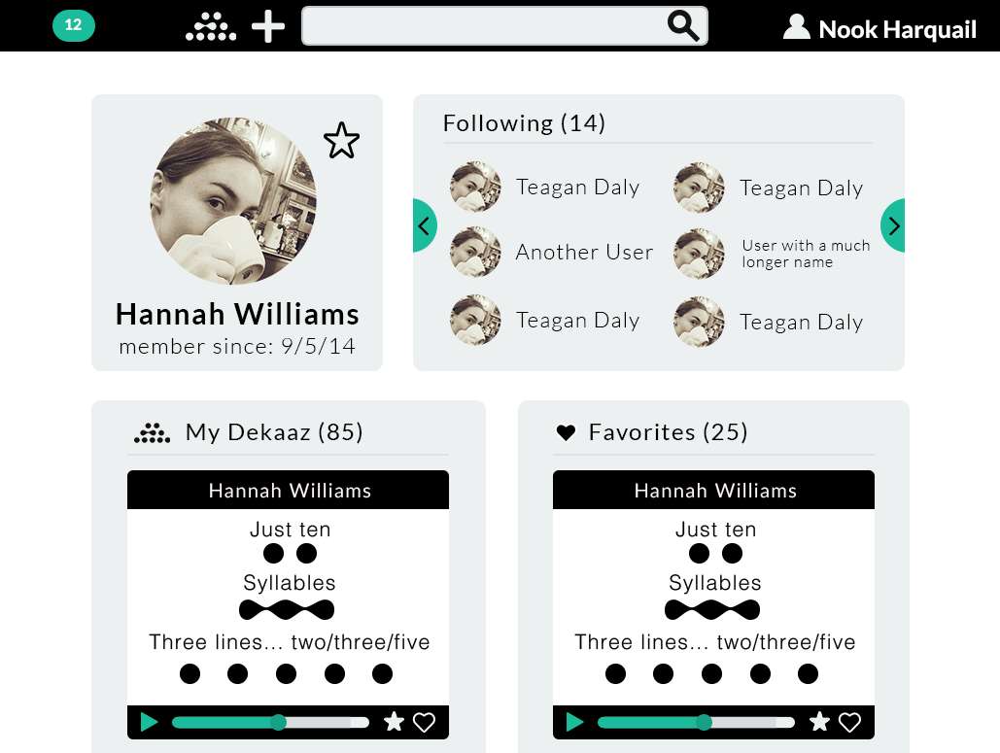
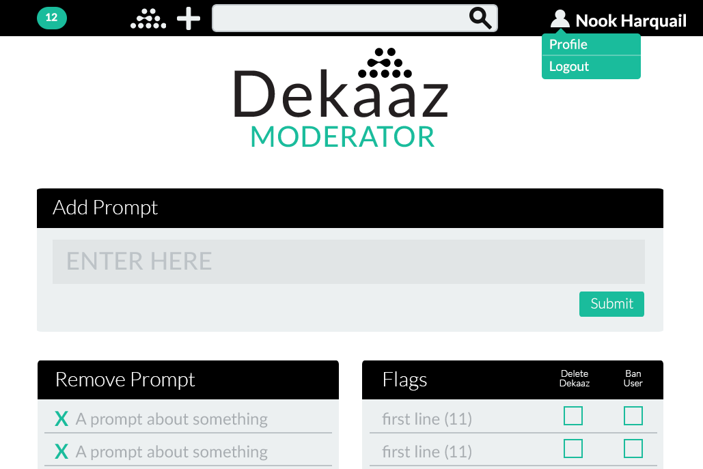

Dekaaz is a performative poetry form, created by [Rachel Bagby](http://rachelbagby.com/about-contact/).   Dekaaz is similar to the Haiku, although it is based on syllable pattern rather than rhyme. We based the UI design on the [Flat UI](https://designmodo.github.io/Flat-UI/) framework, for rapid development.  Designed with [Hannah Williams](https://www.linkedin.com/in/hannahgwilliams14).  I also worked with the developers to refine design during development.

---

## Mockups

---

# Feature Specification

---

## Live Site

Completed site at: [dekaaz.dali.dartmouth.edu](http://dekaaz.dali.dartmouth.edu).  Developed by [Tim Tregubov](http://www.zingweb.com), [Charlotte Blanc](https://twitter.com/charlotteablanc), [Robbie Neuhaus](http://rneuha.us/), and Paul Roberts.

---
