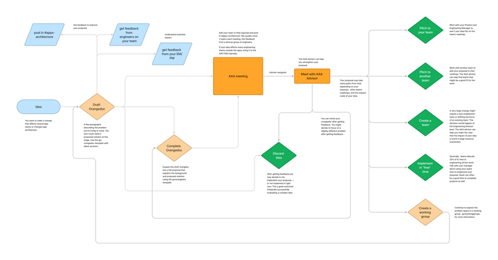

At [Etsy](https://www.etsy.com/) I helped establish the App Architecture Advisors group (AAA). The AAA is a rotating panel of engineers that help shepherd engineers through Etsy's internal  [RFC](https://en.wikipedia.org/wiki/Request_for_Comments) process and advocate for their ideas. Every two weeks we hold a public office hours meeting to discuss proposals. This group was modeled on an existing architecture group that exists for all of Etsy engineering, but ours is focused on the apps (iOS and Android apps for both buyers and sellers).
 
People have brought proposals on wide-ranging topics — anything that affects multiple teams is fair game.

---

At each open meeting, we read this statement about the group's purpose:

> The purpose of this Office Hours is to assist engineers in effecting change. The App Architecture Advisors (AAA) group exists to give helpful insight on these proposals.
>
> The AAA is not here to approve or deny a proposal. Rather, we want to use this opportunity to improve proposed ideas using input from a diverse group of engineers. 
>
> In short, the goal of this meeting is to provide guidance and enable a holistic architecture vision.

---

Flowchart of common paths for proposals (click to enlarge)