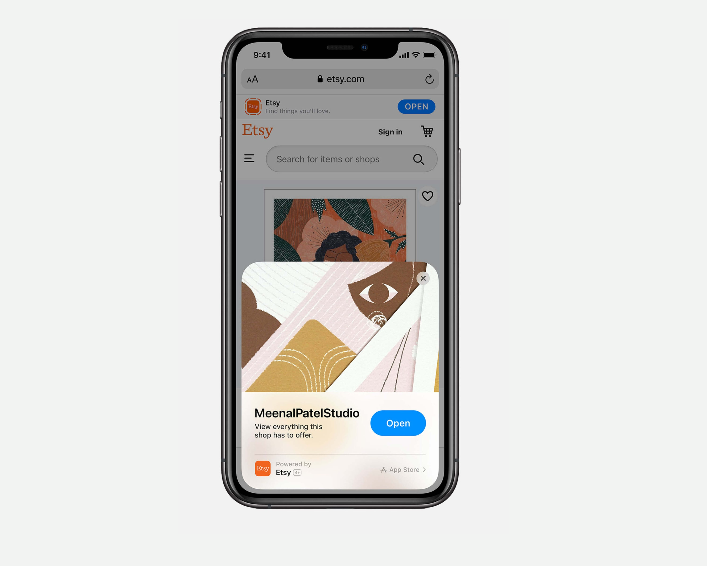
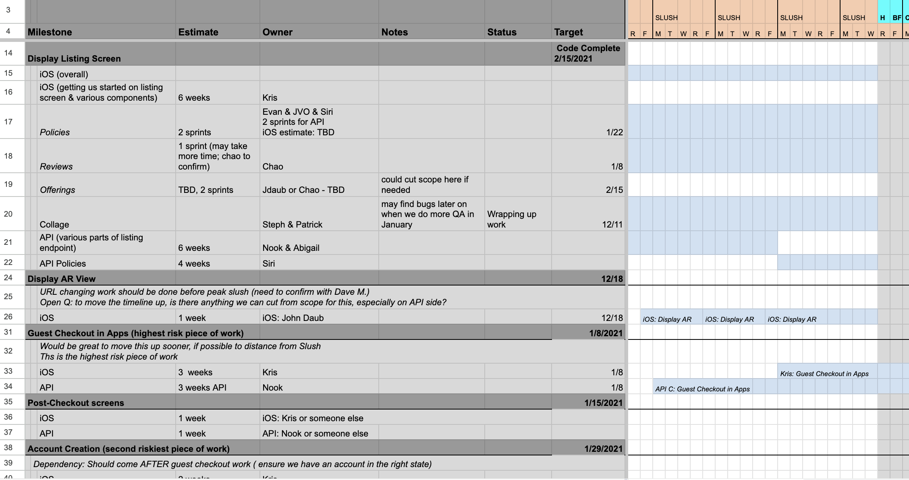

Apple approached [Etsy](https://www.etsy.com/) to be one of the launch partners for the [App Clip](https://developer.apple.com/app-clips/) feature. App clips are a small version of an app that can be launched from a link without installing the full app.  

In 9 months, we built a subset of the Etsy app that allows a buyer to view a product, read reviews, preview the size of some items in AR, and purchase the item.

This was a challenging project due to the complexity of features we needed to build and the short timeline. The majority of these features existed in the full Etsy app, but due to constraints on the size of the app binary (10MB) we needed to rebuild many of the features from scratch. We also built guest checkout, which is not available in the full Etsy app so that App Clip users could make a purchases without registering for an account. If a user installs the full app later, we transfer context so that the guest purchases are associated with their new account. 

---

My role on this project was backend engineering + architecture. We built new API endpoints specific to the App Clip, and used GraphQL for the first time in the apps to streamline data fetching.

In order to deliver against the fixed deadline, we continuously estimated our timelines against goals and continuously updated a GANTT chart to track our progress. The project delivered on time with only minor changes to feature requirements.

Etsy's App Clip was featured in various [media](https://www.wired.co.uk/article/apple-app-clips) [articles](https://www.macstories.net/stories/app-clips-in-ios-14-the-right-app-at-the-right-time/) and in Apple's launch of the app clip feature at [WWDC 2020](https://developer.apple.com/videos/play/wwdc2020/10174/). The success of the project was measured by order numbers and installations of the full Etsy app. 

---
