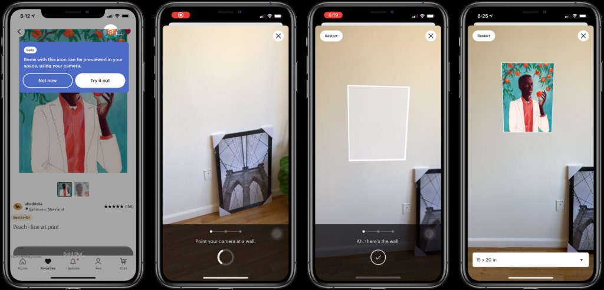
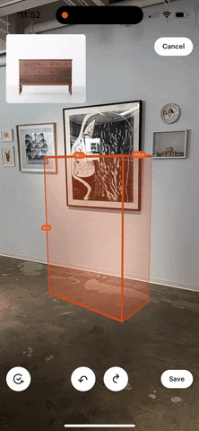
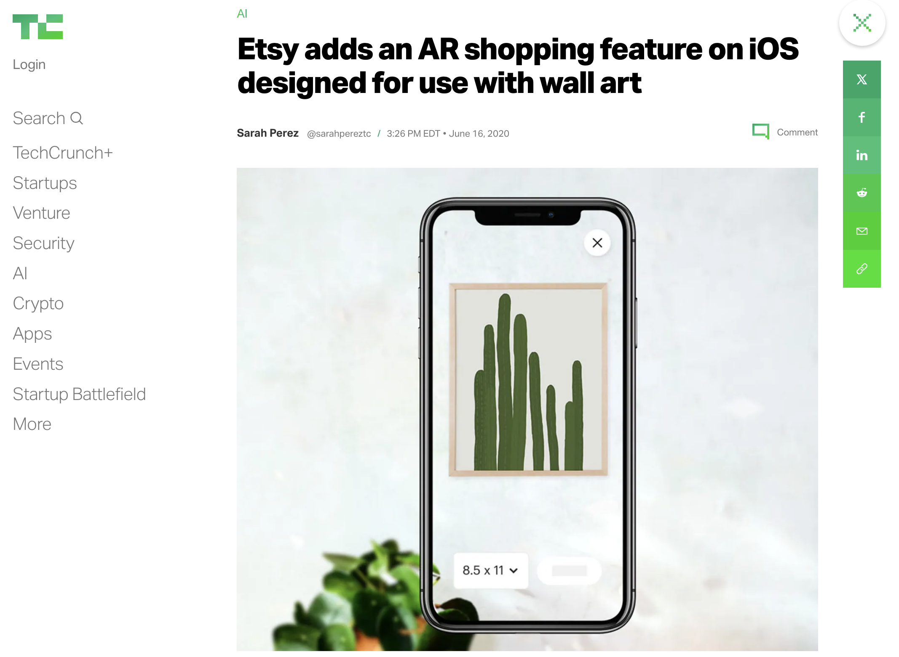

I was tech lead on a team at [Etsy](https://www.etsy.com/) that built features to preview objects (eg. wall art, rugs, tables) in a user's room.

For wall art, we display preview of the object on the user's wall. For three-dimensional objects we display a translucent cube that shows the object's size. This project was built in multiple stages with each stage released as an A/B test. We also tested several prototypes with users along the way.

My role on this project was to lead the backend implementation. One of the challenges we had was that very few listings have structured size information. Instead of well-defined size data, listings on Etsy had free-form text that described the listing. We developed an algorithm to infer the dimensions from listing data (titles, descriptions, product offerings). After experimenting with an ML model and several off-the-shelf tools, we found that a long regex expression that parsed size data from listings was a good approach. With this approach, we were able to achieve high accuracy (measured against human-annotated data) and cover ~70\% of listings in the wall art and furniture categories.

We also had complex challenges on the client, which you can read more about in our [blog](https://www.etsy.com/pl/codeascraft/chaining-ios-machine-learning-computer-vision-and-augmented-reality-to-make-the-magical-real) [posts](https://www.etsy.com/codeascraft/the-ar-measuring-box-etsys-answer-to-big-tape-measure).

---

This project was highly visible internally and externally. Executives were frequently updated on our progress, and other parts of the organization (eg. marketing and seller support) coordinated with us to announce the feature to users.

Our [press release](https://www.etsy.com/news/visualize-wall-art-with-augmented-reality-on-the-etsy-app) was picked up by multiple news sites, including [TechCrunch](https://techcrunch.com/2020/06/16/etsy-adds-an-ar-shopping-feature-on-ios-designed-for-use-with-wall-art/?guccounter=1) and [The Verge](https://www.theverge.com/2020/6/16/21293063/etsy-ios-app-augmented-reality-art-update).

---

Thanks to  [Han Cho](https://www.linkedin.com/in/han-cho/), [Mahreen Ijaz](https://www.linkedin.com/in/mahreen-ijaz-880/), [Kate Matsumoto](https://www.linkedin.com/in/katematsumoto/), [Siri Mcclean](https://www.linkedin.com/in/sirimcclean/), [Pedro Michel](https://www.linkedin.com/in/pedro-michel/), [Jacob Van Order](https://www.linkedin.com/in/\%F0\%9F\%8E\%89-jacob-van-order-\%F0\%9F\%8E\%89-8438672/), and [Evan Wolf](https://www.linkedin.com/in/evan-wolf-5002a2111/) who worked with me on this project.

---
