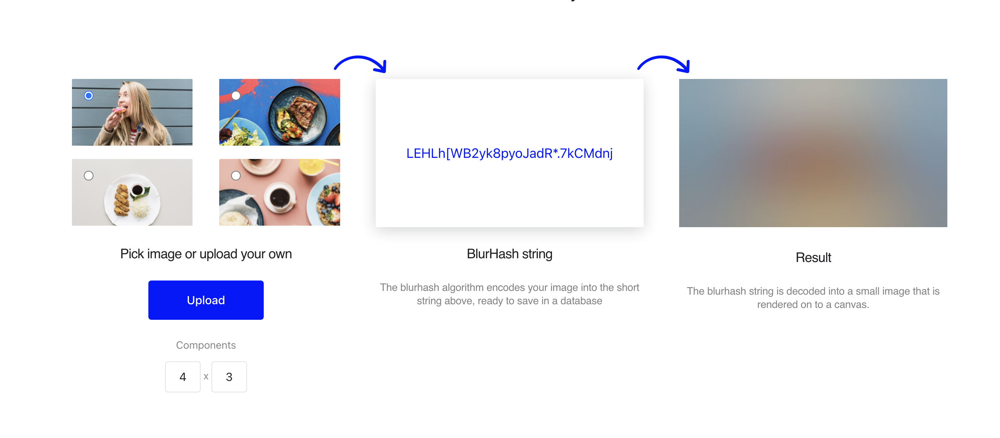

A [blurhash](https://blurha.sh/) is a compact representation of an image than can be decoded to create a blurred image preview.

My product manager at [Etsy](https://www.etsy.com/) asked for ways to make the app feel faster. I proposed several ideas, including using blurhash to improve the perception of speed for our users. We decided this idea was worth testing.

I built a prototype of this in our iOS app, which product and design used to decide on the 

At a high level, the steps we took were:
 1. Add an ansynchronous step to image upload that calculates a blurhash on upload
 1. Encode a blurhash for every actively-used image in storage (backfill)
 1. Add blurhash to the API response for key endpoints
 1. When the blurhash is present in the API response, decode it on the client to display a blurred image preview while the image is loading
 1. Measure the results in an A/B test 
 
This was a particularly large change, because we needed to touch many API endpoints (every endpoint that delivered images) in this experiment. We also needed to coordinate with other teams to make sure that new changes included our experiment.

This experiment was revenue positive and UX improvement.

---

Thanks to [Han Cho](https://www.linkedin.com/in/han-cho/) and [Kate Matsumoto](https://www.linkedin.com/in/katematsumoto/) for giving me the time and space to implement this.

---
