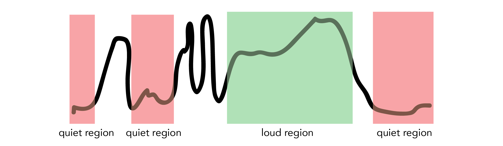

Field is a prototype iOS app that helps users create looping, musical videos through a remixing algorithm that layers sounds in rhythmic patterns. Created with [Andrew Alburn](https://www.linkedin.com/pub/andrew-alburn/54/157/a9) and [Jadie Oh](http://www.jadieoh.com/) at [Viacom Lab](http://www.viacomlab.com).

---

## Problem Statement
How might we help amateurs create vine-length music videos?

---

## UX Design

Mockups of potential interfaces for Field.

 

---

## Prototype

Prototype iOS app created through ~3 weeks of iteration in Swift.

 

---

## Algorithm

Capture audio signal:

Filter signal:

Detect peaks:

Find loud and quiet regions:

Combine peaks + loud regions to find sample regions: 

Randomly sample from within sample regions, choosing short clips that are either within the loud regions or aligned with peaks.

Finally, layer the samples in beat patterns, randomly selecting from a set of manually-curated rhythms designed to combine musically:  	

Play layered audio and video.

---

## Creations

Videos created with Field (click bottom right for sound).

 
See more fields [here](https://vine.co/u/1278073875980595200).

 
 

---
