Kindle Mount is a product design prototype for Dartmouth's marching band.  Marching bands are switching from paper sheet music to tablets.  They need a reliable way to attach these devices to instruments.  Our design attaches to a wide range of tablets, using the standard lyre attachment for band instruments.   Designed with [Marissa Allen](www.cs.dartmouth.edu/~mallen/) in SolidWorks.  Parts will be injection molded and brought to market in late 2015.

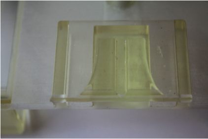

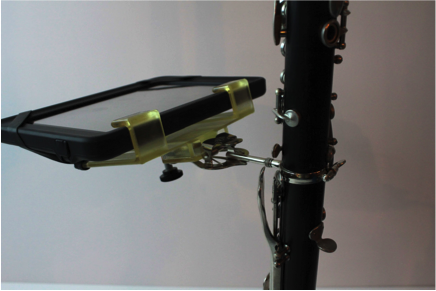

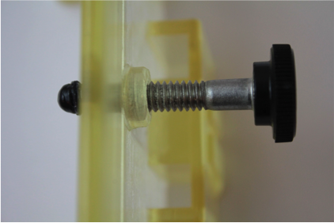

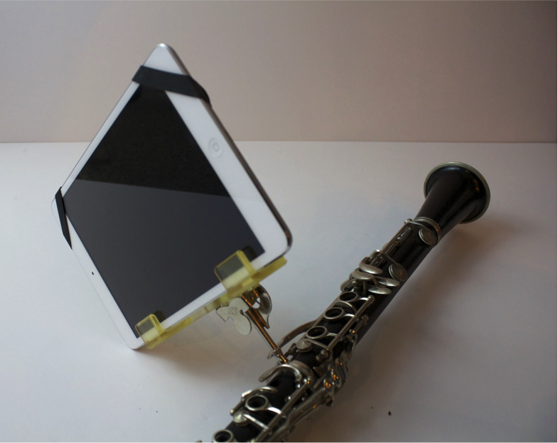

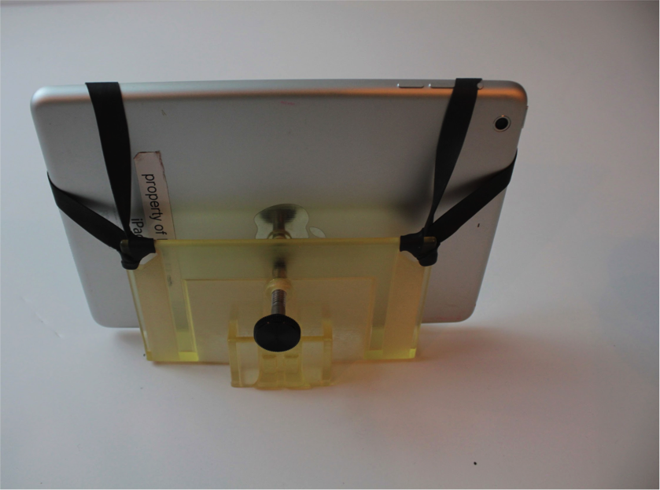

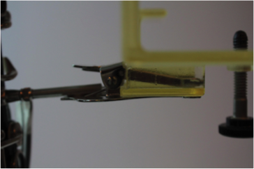

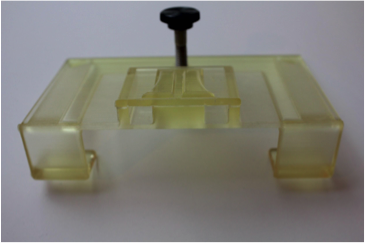

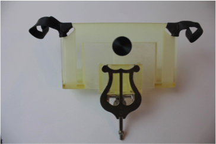

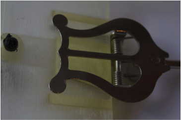

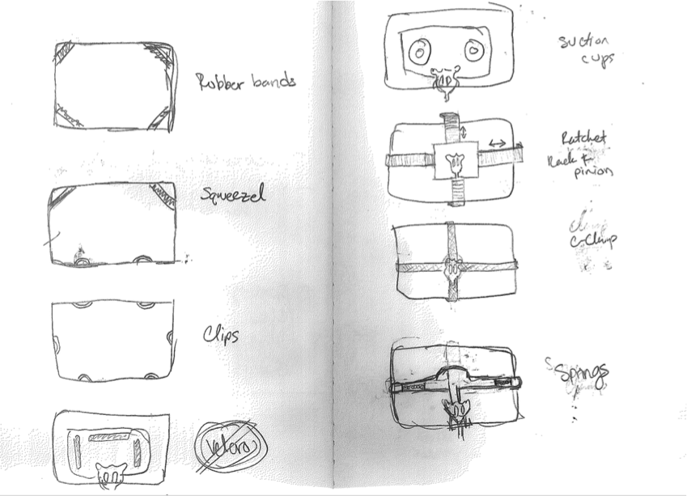
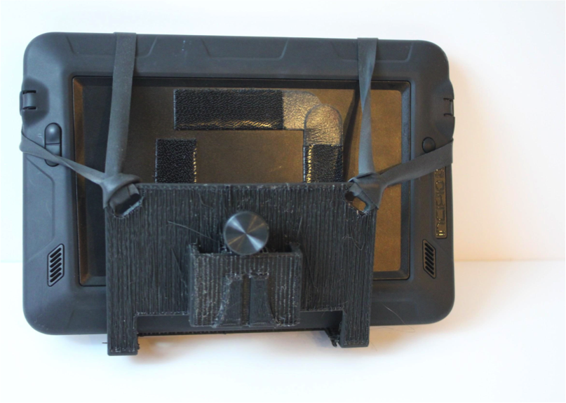
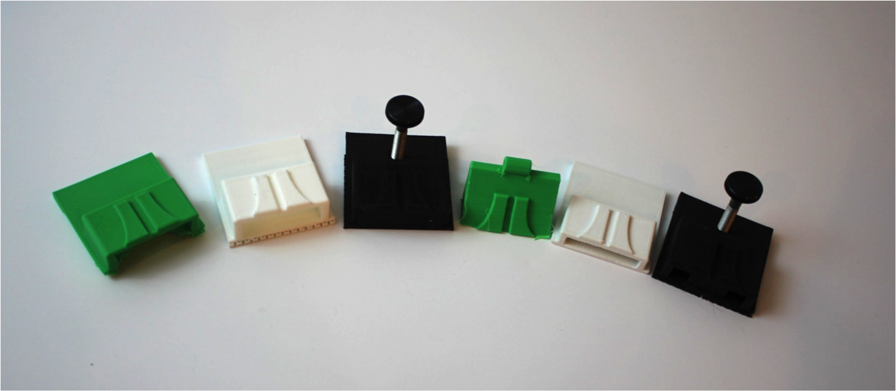

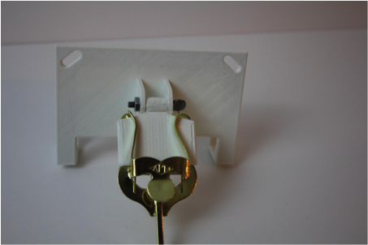

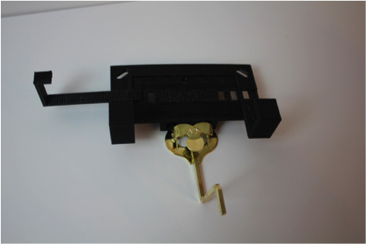

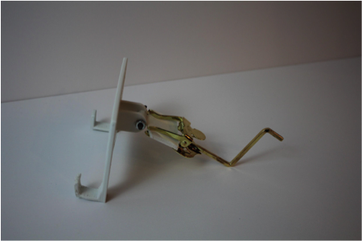

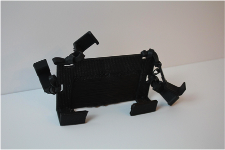

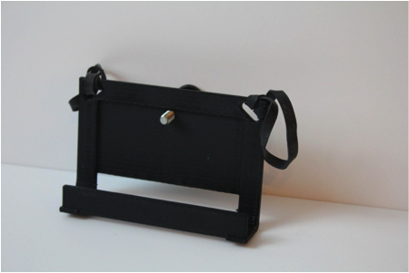

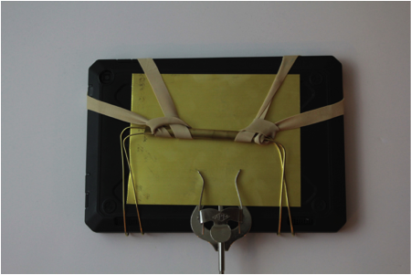

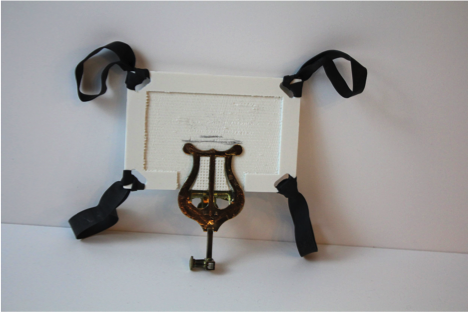

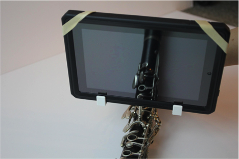

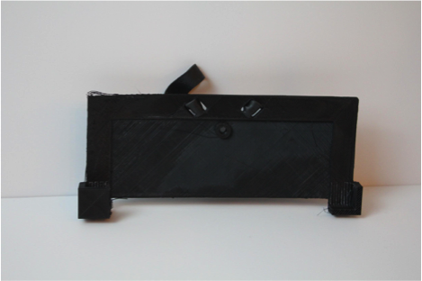

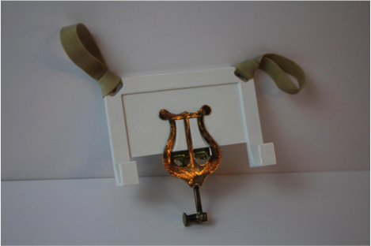

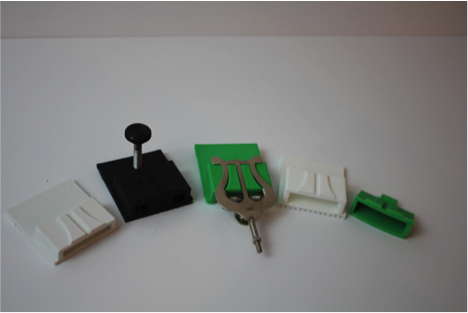

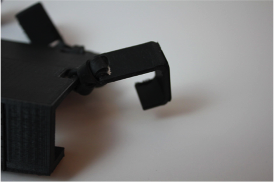

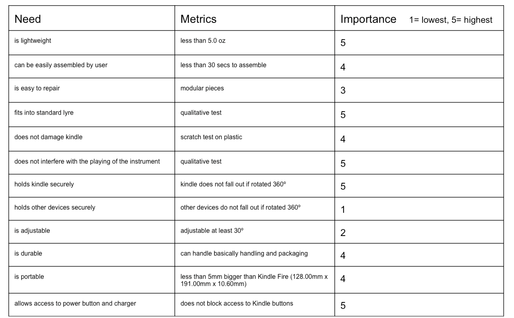

---