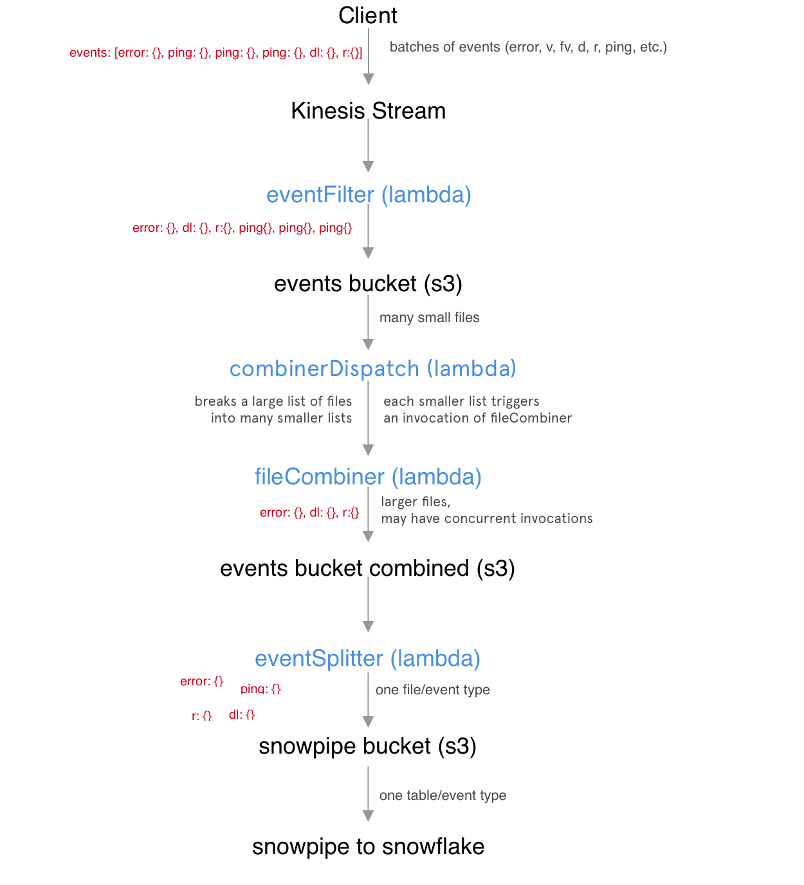
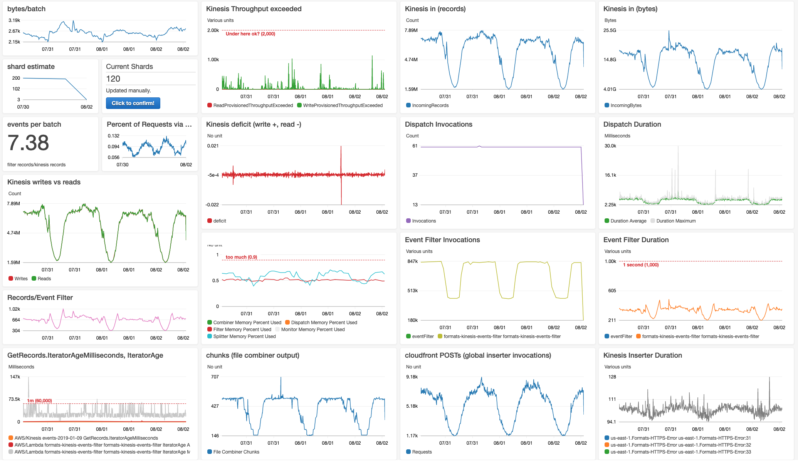
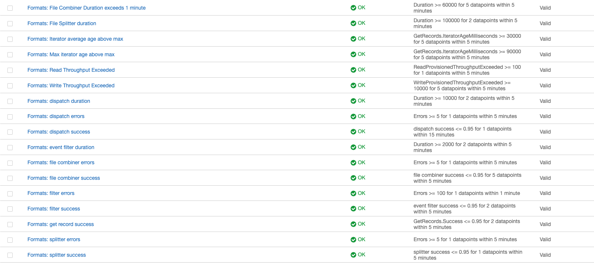

[Yieldmo](https://yieldmo.com) processes as large number of events (8+ billion events each day). We built a new system to process this event data from the client to our data warehouse. 

As we added new events and traffic, we were running up against the limits of the existing system, which used Kafka event streams. Custom-built Java servers consumed the data and loaded it into our data warehouse in Protobuf format. Although this system was reliable, it was difficult to add new events (multiple teams needed to modify the schema) — and because servers were deployed manually, spikes in event traffic led to significant lag. Data was least accessible when we needed it the most (during spikes in errors or traffic).

Goals for the new system:
- 1) Easy to add new events with varied schemas
- 2) Scale up to 100x to handle spikes in traffic or new event types

---

We built the new event processing system on Amazon Web Services, using [kinesis](https://aws.amazon.com/kinesis/) to ingest data and serverless functions ([lambdas](https://aws.amazon.com/lambda/)) to process it. Kinesis is a streaming service that plays a similar role to Apache Kafka. [This](https://docs.aws.amazon.com/streams/latest/dev/key-concepts.html) is a good overview of the system. One thing to note is that Kinesis operates based on 'shards'. For each set of records, the client sends a key, which in our case is a random identifier for the page view. Based on a hash of this value, kinesis stores the record in a shard that consumers can read from.  

Our system's flow is: 
 - 1) Client puts many events with arbitrary structure into Kinesis
 - 2) A lambda pipeline splits out events to create one file for each type of event in S3
 - 3) A job loads each file into the corresponding table in a data warehouse (schema definition)
 - 4) People and systems query data from the warehouse

This structure reduces the systems that are about the shape of the data to two: the client that produces the data and the schema definition that loads data into the warehouse. We can even start sending new events and define the schema later, because data is saved in S3 for several months. This buffer also allows us to experiment with new methods of aggregation on historical data. 

---

## Lambda pipeline

Three lambda functions form the core of the system:
- 1) *eventFilter* 
	- We send multiple events in a single 'record' to take advantage of Kinesis pricing (each record has the same cost up to a size cap). This lambda outputs an S3 file with a row for each event in the stream, and adds information. It also rejects events that do not match our basic event structure (eg. malformed data or DDoS attacks).
- 2) *fileCombiner*
	- *eventFilter* produces hundreds of files each second. This lambda downloads files created by the filter and combines them into larger files, which are stored in a new S3 bucket. This step drastically reduces costs by operating on larger batches.
- 3) *eventSplitter*
	- For every file created by *fileCombiner*, creates a file for each type (defined by a field in the event object). Again, these files are stored in S3 within a directory structure that separates them by event type and then date.

Between each step in the lambda pipeline, we keep data in S3 for a period of time. This is useful for testing, and allows us to recover from any errors easily within the TTL. The last step in the pipeline is Snowpipe, which loads the data into Snowflake. For each file type created by the *eventSplitter*,  we define a schema definition that creates a table in Snowflake. 

Additional jobs operate in snowflake to create aggregations from the events, and remove duplicate data (this architecture guarantees [at least once](https://bravenewgeek.com/you-cannot-have-exactly-once-delivery/) delivery).

---

## Scaling

In scaling to processing billions of events per day, we found that our bottleneck was *fileCombiner*. The *eventFilter* lambda scales automatically as we add new shards, with an instance of the lambda reading constantly from each shard. *eventSplitter* is similarly scalable, because functions run in parallel as files are created by the combiner. *fileCombiner*, however, ran in series. We had defined the lambda to run a schedule using a *Cloudwatch* timer, with a new lambda invocation running each minute. As we scaled to write more files from *eventFilter*, the previous invocation of the lambda was not always finishing before the next invocation began. This resulted in duplicated work because the same data was processed twice. To resolve this issue, we added *combinerDispatch*. 

Rather than downloading the full files, *combinerDispatch* gets the list of files the have not been processed in S3. It uses this information (including file sizes) to invoke instances of the *fileCombiner* lambda with a list of files that can be processed within a minute. This allows the combination step to happen in parallel.

The next bottleneck will likely be S3 bucket read/write limits, which are fairly easy to manage. We could change the architecture to use a separate bucket for each Kinesis shard and/or duplicate the infrastructure in each region where we have significant traffic.  

Overall, the system can be scaled up an down simply by changing the number of shards in the Kinesis stream.

---
## Resilience and Data Quality

Any lambda may fail at any point, leaving data in a half-processed state. Luckily, the lambda architecture is very resilient to failures, because it will re-invoke the lambda with the same records if it does not return success. So, as long as we write the lambdas to throw errors rather than fail silently, we do not lose data if a single instance fails. 

As with any data pipeline, data quality is an important issue for us. Because Yieldmo ads run a large variety of mobile devices and browser, we often see unexpected data. We have developed manual and automated systems to review these abnormalities and fix the majority of them in the Snowpipe schema definition. Most of our problems were a mismatch between the data sent by the client and the schema's expectation.  Sometimes, it makes sense for us to set a default value, or set a valid range of values in addition to the data type.

---
## Monitoring

Because events are a critical system for us, we have a lot of monitoring around this infrastructure. We created [CloudWatch](https://aws.amazon.com/cloudwatch/) dashboards to monitor key metrics: including event counts, memory usage, and event delay. In addition, we have a job that periodically reads data from the data warehouse to check that event counts are consistent with what we are seeing in the AWS infrastructure. Snowpipe errors are also surfaced in CloudWatch.

Based on metrics from CloudWatch, we also created alerts to notify the on-call engineer. Because of the data-buffering design, most problems can be handled during office hours. There are only a few problems that require manual intervention to prevent data loss (for example, writes from the client exceeding the Kinesis throughput limit). We created a runbook that allows engineers to respond to an alert even if they are not familiar with the system. 

---

Built with [Andrew Quale](https://www.linkedin.com/in/andrew-quale-2765372/) and [Melody Li](https://www.linkedin.com/in/melody-li-7578bab1/), with support from the Ad Formats and Data teams at Yieldmo.

---
