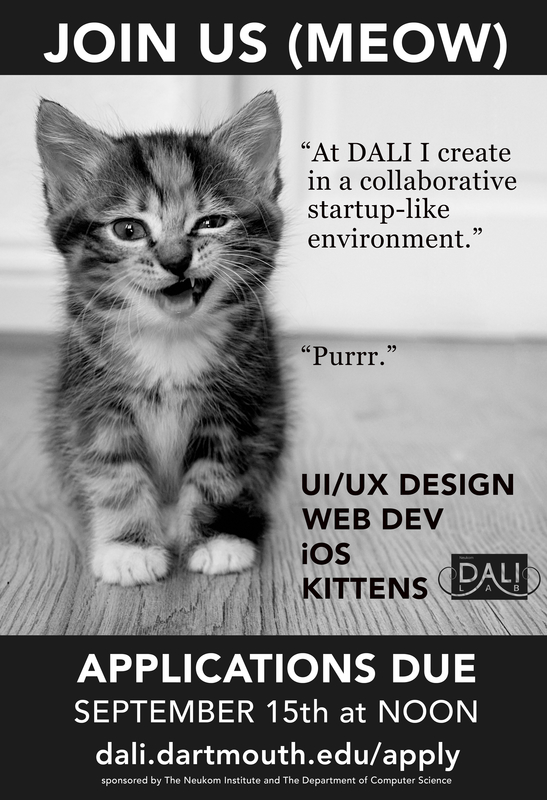
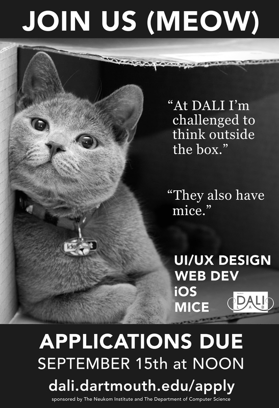
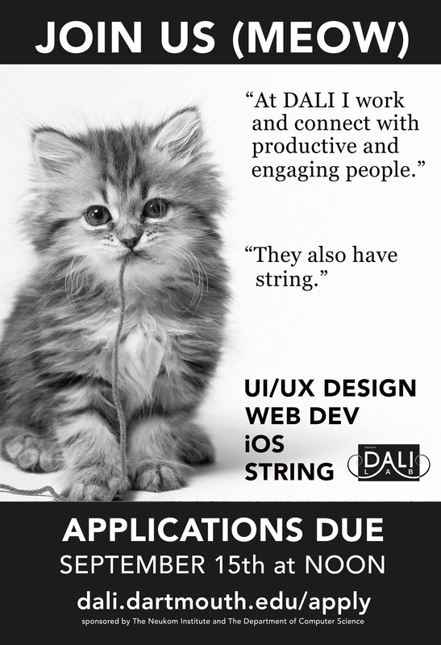
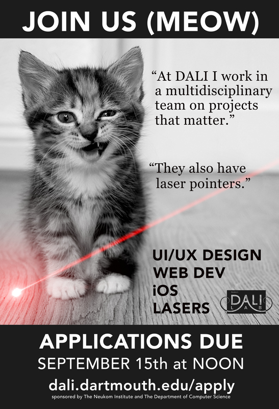

An advertising campaign to attract new members to join the [DALI Lab](http://dali.dartmouth.edu).  As a result of this poster campaign and other marketing efforts, applications to join the lab doubled.  In Fall 2014, we were only able to accept 20% of applications.  Designed with [Runi Goswami](http://dali.dartmouth.edu/team/runi-goswami/), [Hannah Williams](http://dali.dartmouth.edu/team/hannah-williams-14/), and [Tim Tregubov](http://www.zingweb.com).  We created these designs with generous [bleed](https://en.wikipedia.org/wiki/Bleed_%28printing%29), as the posters were trimmed to size.

 
 
 
 
