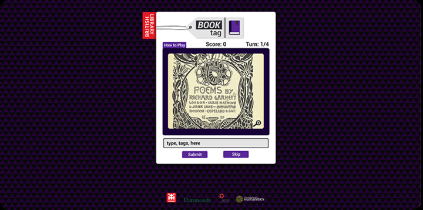
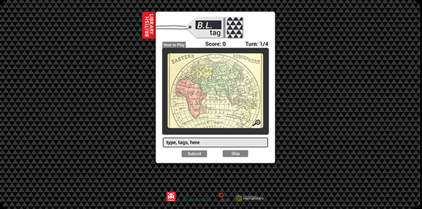
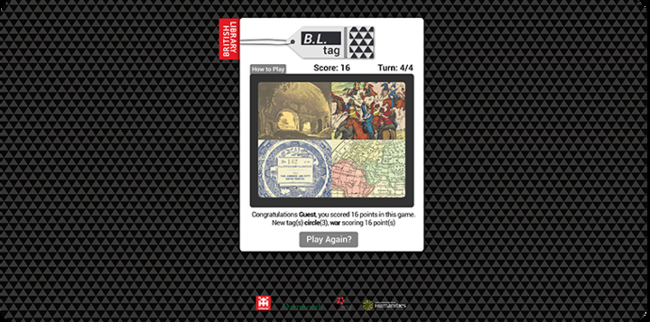
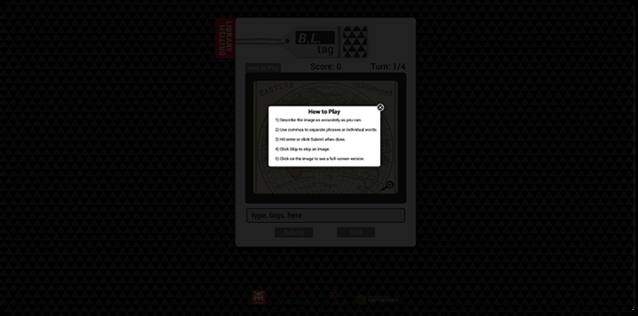
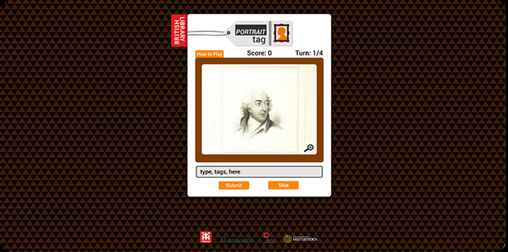

As part of the [Metadata Games](http://www.tiltfactor.org/metadata-games-tag-event-may-day-may-day/) project, I redesigned the interface and gameplay of a game produced by [Tiltfactor](http://tiltfactor.org).

Tiltfactor's Metadata Games is a free, open source, game system that augments access to archival records.  Tiltfactor is a game research lab at Dartmouth College dedicated to understanding how games can be used to generate new knowledge.

---

Designed with [Winnie Yoe](http://winnieyoe.com/)

---