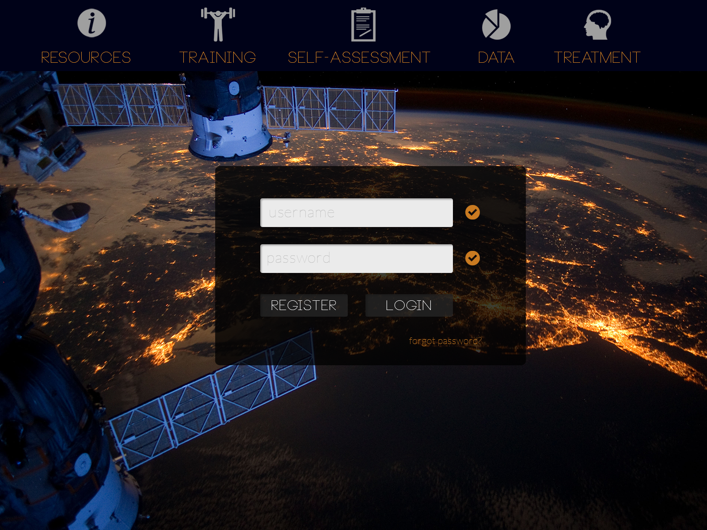
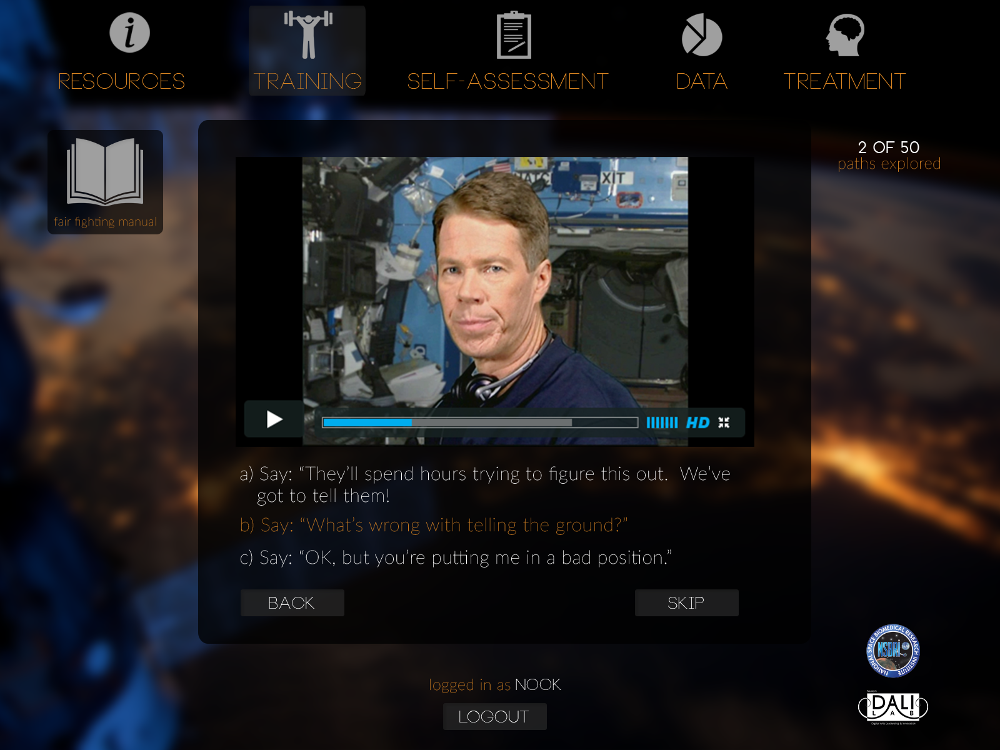

Psych on Ice is a project funded by the National Space Biological Research Institute.  At [DALI](http:/dali.dartmouth.edu), I was a designer and project manager on the project for 6 months.

Psych on Ice is a website that aims to help astronauts reduce the stress of non-duration space flight, and practice conflict management through interactive scenarios.  For the interactive scenarios, we used a slightly modified version of the [Undum Framework](https://github.com/idmillington/undum).

Visit the live site [here](http://vss.eu1.frbit.net/).

---

---