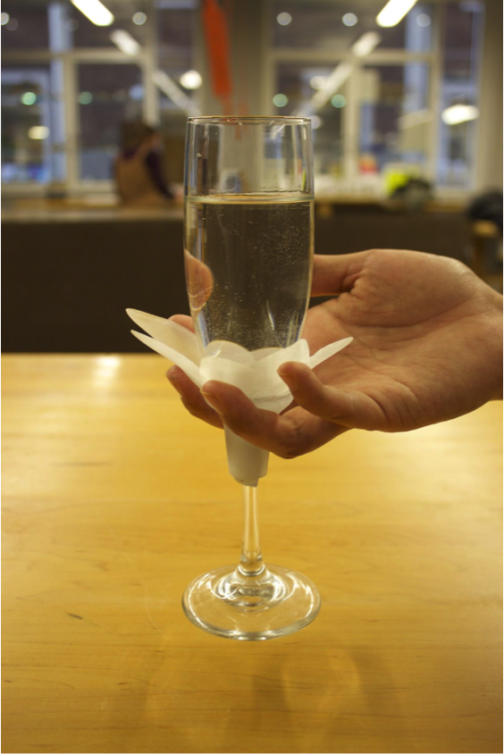
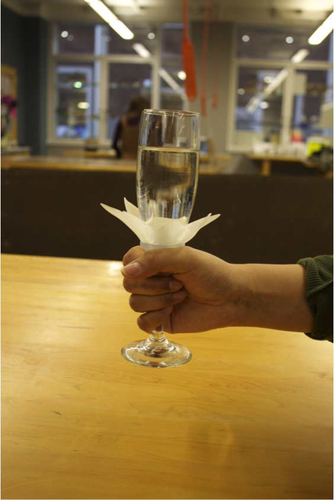
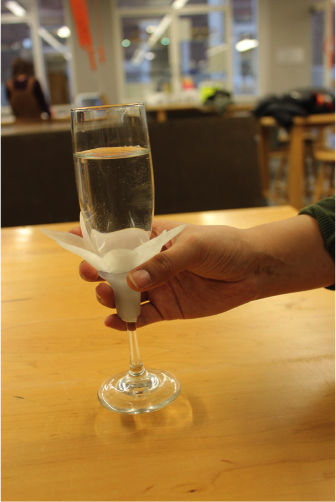
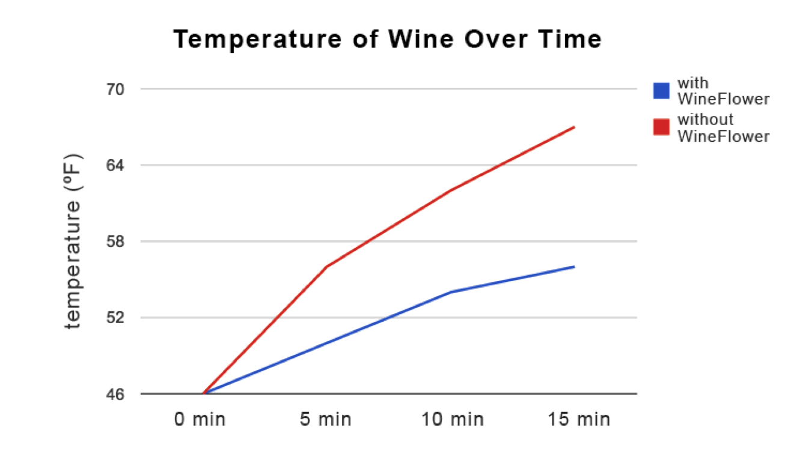
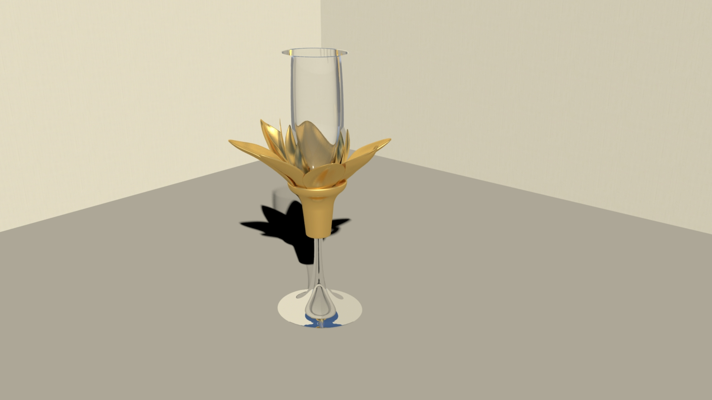
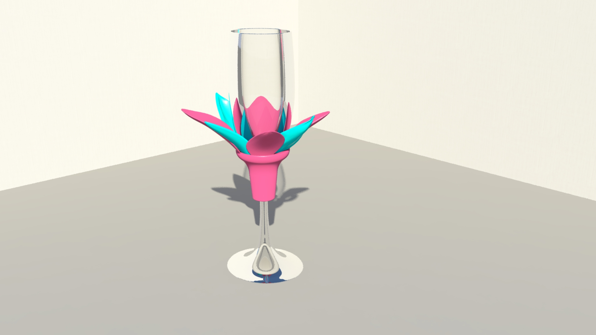
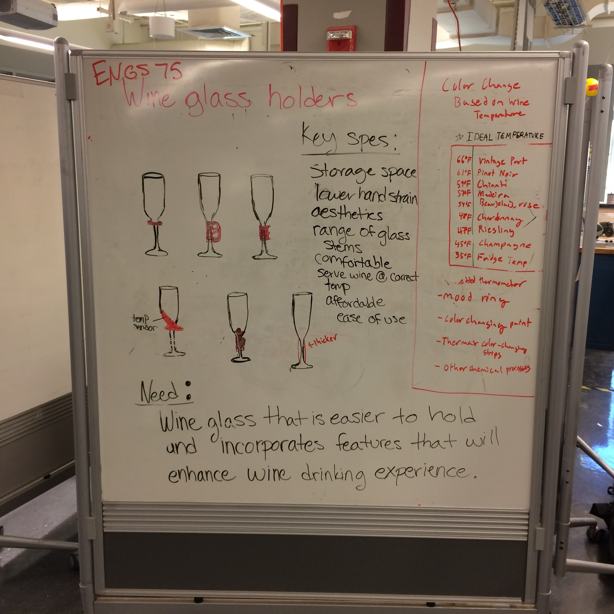
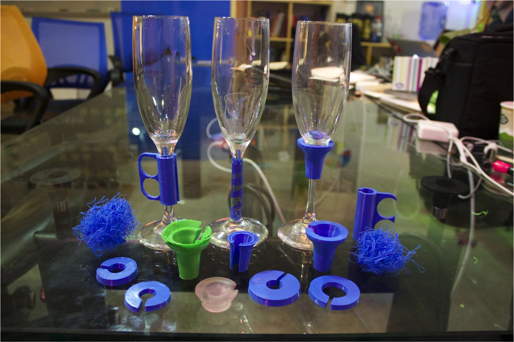

WineFlower is a product design prototype, designed to solve two problems: 1) Most people hold wine glasses "incorrectly," raising the temperature of the wine through body heat 2) Wine glasses are easy to confuse in a party setting.  Created with [Marissa Allen](http://www.cs.dartmouth.edu/~mallen/) using SolidWorks and a 3d printer for rapid prototyping.

---

 

 

