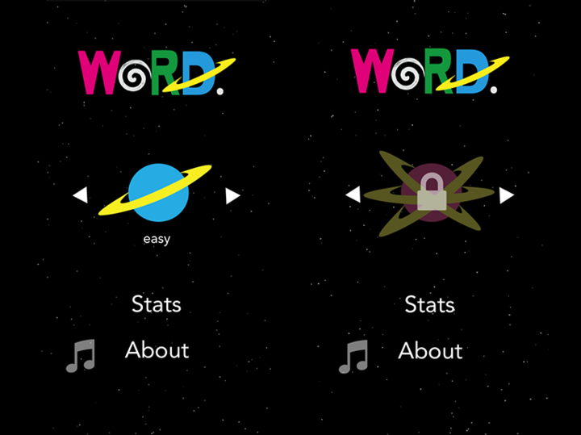
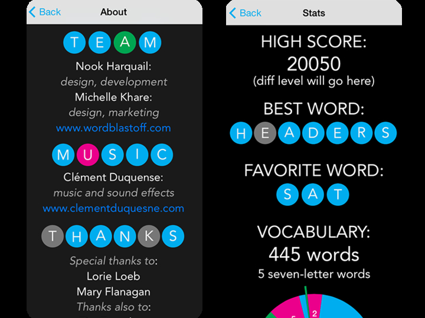
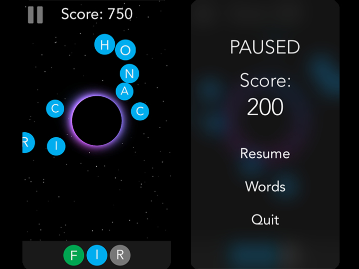
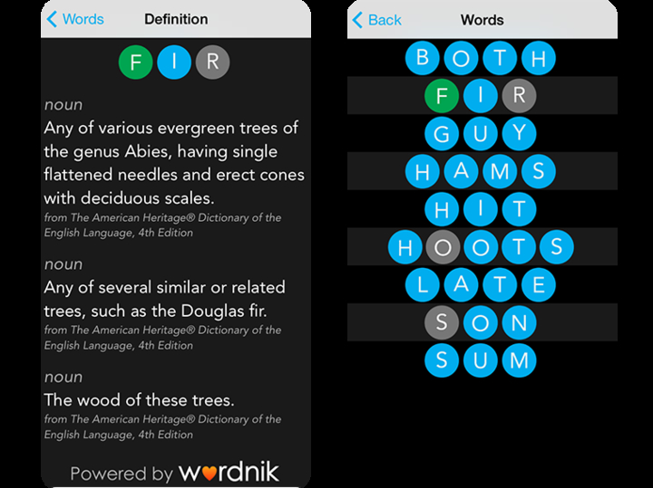
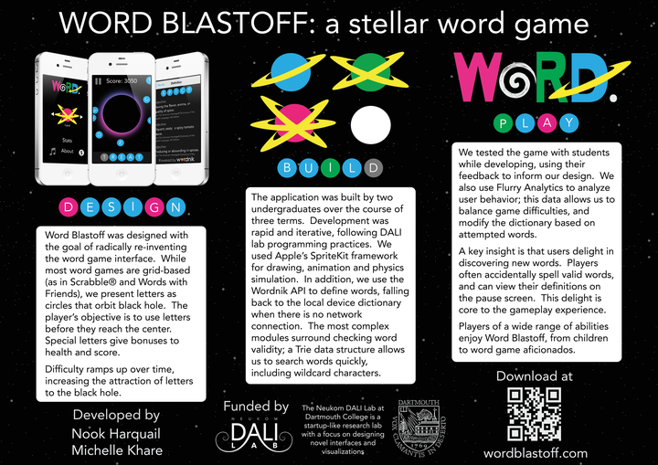

I created a word game as my undergrad senior thesis in Computer Science.  Word Blastoff seeks to reinvent the traditional, grid-based word game, and is now available in the [Apple App Store](https://itunes.apple.com/us/app/word-blastoff/id877403321?ls=1&mt=8).
For more information, visit [wordblastoff.com](http://www.wordblastoff.com).

---

 

---

Development and game design by me, marketing and design by [Michelle Khare](http://michellekhare.wix.com/michellekhare).