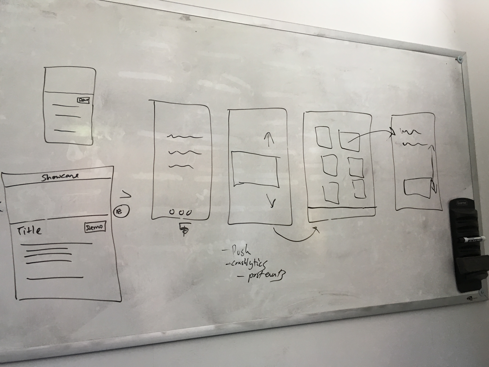
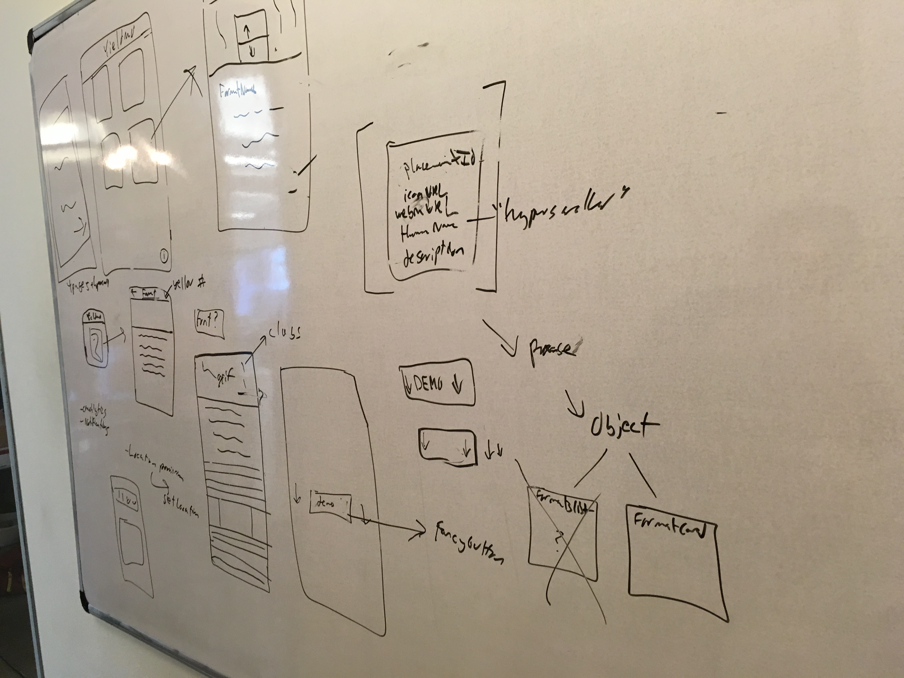
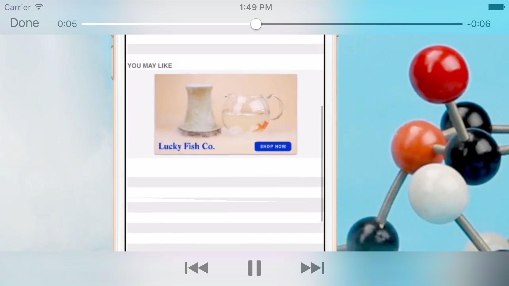

We built an app to showcase Yieldmo's v4.0 [iOS SDK](/portfolio/ym-ios-sdk/). 

Available in the App Store and on Github soon.

---

Due to resource constraints, we designed the interaction and UI ourselves, taking cues from the [Ad Builder](https://adbuilder.yieldmo.com/) tool.  Our iOS product was validated by Yieldmo's design team, and used as the template for the Android app as well.

---
Whiteboard wireframes:

---
Screenshots:

---

Created with [Elber Carneiro](https://github.com/elberdev), [Rahul Rao](https://www.linkedin.com/in/rahul-rao-0215511a), with help from [Tiffany Jen](http://www.tiffanyjen.com/) and the product teams at [Yieldmo](https://yieldmo.com/).

---

