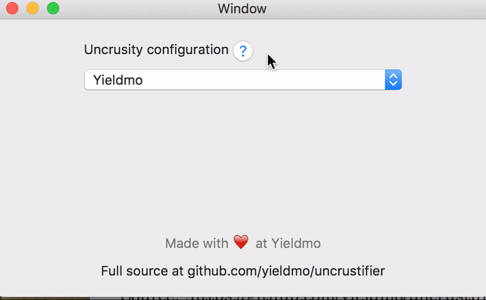

At Yieldmo, we used the BB-Uncrustify plugin to format our Objective-C source code.  Xcode 8 ended support for plugins that directly modify Xcode, breaking workflows for everyone who relied on [Alcatraz](https://github.com/alcatraz/Alcatraz/issues/475) plugins.

---

I created Uncrustifier as an [Xcode Source Editor Extension](https://developer.apple.com/videos/play/wwdc2016/414/) to meet our development team's need.  We released the plugin as an open-source project, and have been delighted to receive contributions and feedback from the community on Github.

Source: [https://github.com/yieldmo/uncrustifier](https://github.com/yieldmo/uncrustifier)

---

---

